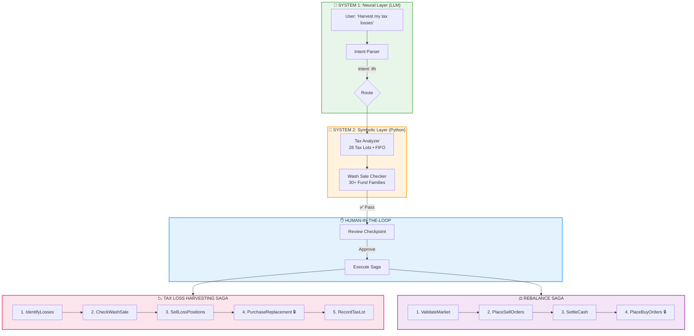

# 🤖 Cyborg Advisor

<div align="center">

### **The Neurosymbolic Portfolio Rebalancer**

*A reference implementation of the "Deterministic AI Pivot" for Wealth Management*

[](https://python.org)
[](https://langchain-ai.github.io/langgraph/)
[](https://react.dev)
[](https://fastapi.tiangolo.com)
[](https://typescriptlang.org)

---

**LLMs handle intent. Python handles math. Humans stay in control.**

*Now with Tax-Loss Harvesting and a premium React SaaS dashboard.*

</div>

---

## 🆕 What's New: Tax-Loss Harvesting + SaaS Stack

### Tax-Loss Harvesting Saga

A complete 5-step Saga for automated tax optimization:

```
IdentifyLosses → CheckWashSale → SellLossPositions → PurchaseReplacement 🔒 → RecordTaxLot
```

**Key Features:**
- ✅ **Expanded Wash Sale Detection** — Catches "substantially identical" securities across fund families (VTI ≈ ITOT ≈ SCHB)
- ✅ **FIFO Tax Lot Tracking** — 28 mock tax lots for realistic testing
- ✅ **Tax Impact Calculator** — Short-term (29%) vs long-term (15%) savings estimates
- ✅ **Pivot Transaction Safety** — Point-of-no-return after replacement purchases

### Premium React Frontend

A dark-themed SaaS dashboard with glassmorphism design:

| Page | Features |
|------|----------|
| **Dashboard** | Portfolio stats, allocation chart, activity feed |
| **Portfolio Manager** | Inline editing, CRUD operations, weight visualization |
| **Rebalance Center** | Target allocation sliders, trade preview, saga execution |
| **Tax Loss Harvesting** | Loss scanner, wash sale indicators, tax savings calculator |
| **Saga Monitor** | Execution history, step-by-step visualization, audit logs |

### FastAPI Backend

RESTful API with real-time saga monitoring:

- `GET /api/v1/tax-loss-harvest/opportunities` — Scan for losses
- `GET /api/v1/tax-loss-harvest/wash-sale-check?asset=VTI` — Check wash sales
- `POST /api/v1/tax-loss-harvest/execute` — Run TLH saga
- `WebSocket /api/v1/saga/{id}/ws` — Real-time updates
- `GET /api/v1/saga/{id}/stream` — Server-Sent Events

---

## 📖 Why This Exists: The Trust Wall

> *"The year 2026 stands as a definitive inflection point... The 'GenAI Bubble' of 2024-2025 has cooled, giving way to a more rigorous, disciplined operational reality."*
> — **The Deterministic AI Pivot**

### The Problem with "GenAI Chatbots" in Finance

| ❌ The Problem | Why It Fails |
|----------------|--------------|
| **Hallucinations** | LLMs fabricate numbers and rules with confident language |
| **Non-Determinism** | Same question → different answers (unacceptable for audits) |
| **Black Box Opacity** | No explainable chain of thought for regulators |
| **Zero Tolerance** | A single miscalculation = millions in liability |

### The Solution: Neurosymbolic AI

| System 1 (LLM) | System 2 (Python) |
|----------------|-------------------|
| 🧠 Fast, intuitive | 🔢 Slow, deliberate |
| Intent parsing | Financial calculations |
| Natural language | Pandas/NumPy |
| "What does the user want?" | "What are the exact numbers?" |

> **The Core Principle:** LLMs excel at understanding language but are *unreliable at math*. By enforcing strict separation, we achieve intuitive interfaces with **deterministic accuracy**.

---

## 📐 Architecture

### The Neurosymbolic Stack + Transactional Saga Pattern



### Two Sagas, One Pattern

| Saga | Steps | Pivot Point |
|------|-------|-------------|
| **Rebalance** | ValidateMarket → PlaceSellOrders → SettleCash → **PlaceBuyOrders** 🔒 | Step 4 |
| **Tax Loss Harvesting** | IdentifyLosses → CheckWashSale → SellLossPositions → **PurchaseReplacement** 🔒 → RecordTaxLot | Step 4 |

> **Pivot Transaction:** The point-of-no-return. Before it, failures trigger automatic rollback. After it, the system proceeds forward-only.

---

## 🚀 Quick Start

### Option 1: Full SaaS Stack (Recommended)

```bash
# Clone the repo
git clone https://github.com/hiteshdundi01/CyborgAdvisor.git
cd CyborgAdvisor

# Setup Python environment
python -m venv venv
venv\Scripts\activate  # Windows
# source venv/bin/activate  # macOS/Linux
pip install -r requirements.txt

# Start the FastAPI backend
cd backend
pip install -r requirements.txt
python -m uvicorn main:app --reload
# API runs at http://localhost:8000

# In a new terminal, start the React frontend
cd frontend
npm install
npm run dev
# UI runs at http://localhost:5173
```

### Option 2: Streamlit Demo

```bash
# Configure API key
cp .env.example .env
# Edit .env: GOOGLE_API_KEY=your_key_here

# Launch Streamlit
streamlit run app.py
```

### Option 3: CLI Demo

```bash
python main.py          # Full LLM workflow
python main.py --simple # Pure calculations, no LLM
```

---

## 🖥️ The React Dashboard

<div align="center">

| Feature | Description |
|---------|-------------|
| 📊 **Dashboard** | Portfolio stats, allocation chart, activity feed |
| 💼 **Portfolio Manager** | Add, edit, delete holdings with inline editing |
| ⚖️ **Rebalance Center** | Target allocation sliders, proposed trades, saga execution |
| 📉 **Tax Loss Harvesting** | Loss scanner, wash sale indicators, replacement suggestions |
| 🔄 **Saga Monitor** | Execution history, step visualization, audit logs |

</div>

### Design System

- **Theme:** Premium dark mode with glassmorphism
- **Colors:** Cyan (#06b6d4), Emerald (#10b981), Rose (#f43f5e), Amber (#f59e0b)
- **Animations:** Framer Motion for smooth transitions
- **Charts:** Recharts for data visualization

---

## 📉 Tax-Loss Harvesting Deep Dive

### Expanded Wash Sale Detection

The IRS considers securities "substantially identical" even across different providers:

| Fund Family | Tickers (All Substantially Identical) |
|-------------|---------------------------------------|
| Total US Stock | VTI, ITOT, SCHB, SPTM |
| S&P 500 | SPY, VOO, IVV, SPLG |
| Total International | VXUS, IXUS, SPDW |
| Total Bond Market | BND, AGG, SCHZ |
| Gold | GLD, IAU, SGOL |

```python
from src.sagas.tax_loss_harvesting import is_substantially_identical

is_substantially_identical("VTI", "ITOT")  # True — same fund family
is_substantially_identical("VTI", "SPY")   # False — different index
```

### Tax Impact Calculation

The system calculates estimated savings based on holding period:

| Holding Period | Tax Rate | Example Loss | Savings |
|----------------|----------|--------------|---------|
| **Short-term** (< 1 year) | 29% (federal + state) | $1,000 | $290 |
| **Long-term** (≥ 1 year) | 15% (capital gains) | $1,000 | $150 |

---

## 🔧 API Reference

### Tax-Loss Harvesting Endpoints

```bash
# Scan for opportunities
curl http://localhost:8000/api/v1/tax-loss-harvest/opportunities?min_threshold=500

# Check wash sale status
curl http://localhost:8000/api/v1/tax-loss-harvest/wash-sale-check?asset=VTI

# Execute TLH saga
curl -X POST http://localhost:8000/api/v1/tax-loss-harvest/execute \
  -H "Content-Type: application/json" \
  -d '{"tax_lots": [...], "min_loss_threshold": 100}'
```

### Saga Status Endpoints

```bash
# Get saga status
curl http://localhost:8000/api/v1/saga/{transaction_id}/status

# Real-time updates (Server-Sent Events)
curl http://localhost:8000/api/v1/saga/{transaction_id}/stream
```

---

## 📁 Project Structure

```
CyborgAdvisor/
├── app.py                          # 🌐 Streamlit Web UI
├── main.py                         # CLI entry point
├── requirements.txt
├── .env.example
│
├── src/
│   ├── config.py                   # Model configuration
│   ├── state.py                    # AgentState (includes TLH fields)
│   ├── graph.py                    # LangGraph state machine
│   ├── nodes/
│   │   ├── intent_parser.py        # System 1: LLM intent
│   │   ├── financial_calculator.py # System 2: Rebalance math
│   │   ├── tax_analyzer.py         # System 2: TLH calculations
│   │   ├── compliance_check.py     # System 2: Rule validation
│   │   └── human_review.py         # HITL + Saga trigger
│   └── sagas/
│       ├── core.py                 # SagaOrchestrator, TransactionStep
│       ├── rebalance.py            # 4-step Rebalance Saga
│       └── tax_loss_harvesting.py  # 5-step TLH Saga (NEW)
│
├── backend/                        # 🔌 FastAPI Backend
│   ├── main.py                     # API endpoints, WebSocket, SSE
│   └── requirements.txt
│
├── frontend/                       # ⚛️ React + Vite Frontend
│   ├── src/
│   │   ├── App.tsx                 # Router + React Query
│   │   ├── index.css               # Premium dark theme
│   │   ├── components/layout/      # Sidebar, navigation
│   │   └── pages/                  # Dashboard, Portfolio, TLH, etc.
│   └── package.json
│
├── tests/
│   ├── test_saga_core.py           # Saga orchestrator tests
│   ├── test_tax_loss_harvesting.py # TLH saga tests (NEW)
│   └── ...
│
└── docs/
    ├── architecture.md             # Technical diagrams
    └── substack_article*.md        # Build-in-public articles
```

---

## 🧪 Testing

```bash
# Run all tests
pytest tests/ -v

# Test TLH saga (no LLM required)
pytest tests/test_tax_loss_harvesting.py -v

# Test core saga pattern
pytest tests/test_saga_core.py -v
```

### What's Tested

- ✅ Substantially identical detection (30+ fund family mappings)
- ✅ FIFO loss identification
- ✅ Tax impact calculations (short-term vs long-term)
- ✅ Saga forward execution (all steps success)
- ✅ Saga rollback (failure before pivot)
- ✅ Pivot transaction (no rollback after)

---

## 📚 Further Reading

- [docs/architecture.md](docs/architecture.md) — Detailed technical diagrams
- [substack_article.md](substack_article.md) — Part 2: The Saga Pattern
- [substack_article_part3.md](substack_article_part3.md) — Part 3: Tax-Loss Harvesting

---

## 🎓 The Bigger Picture: Tax Alpha

> *"The best AI systems aren't smart. They're relentless."*

Tax-loss harvesting isn't about beating the market—it's about beating the IRS. The math is guaranteed: harvesting losses reduces your tax bill. The challenge is execution:

| Challenge | Human Advisor | Cyborg Advisor |
|-----------|---------------|----------------|
| Track 100 tax lots | ⏱️ 2 hours | ⚡ 50ms |
| Check wash sale rules | 😰 Error-prone | ✅ 100% accurate |
| Know fund families | 📚 Study required | 🤖 30+ families mapped |
| Execute consistently | 😴 Easy to miss | 🔄 Every single day |

This is **Tax Alpha**: not smarter investing, just more patient, more consistent, more relentless execution of rules the IRS already wrote.

---

<div align="center">

### **The Art of the Possible**

*LLMs for language. Python for math. Sagas for transactions. Humans for judgment.*

---

**Built with** 🧠 LangGraph • ⚛️ React • 🐍 FastAPI • 🤖 Google Gemini • 📊 Recharts

**License:** MIT

</div>
