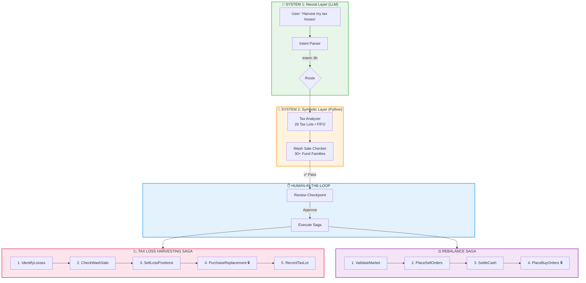

# 🤖 Cyborg Advisor

<div align="center">

### **The Neurosymbolic Financial Advisor**

*A reference implementation of the "Deterministic AI Pivot" for Wealth Management*

[](https://python.org)
[](https://langchain-ai.github.io/langgraph/)
[](https://react.dev)
[](https://fastapi.tiangolo.com)
[](https://typescriptlang.org)

---

**LLMs handle intent. Python handles math. Humans stay in control.**

</div>

---

## 📖 The Story: The Day the Chatbot Died

> *"Warren Buffett once said, 'It takes 20 years to build a reputation and five minutes to ruin it.' AI can do it in five milliseconds."*
> — **The Day the Chatbot Died, Part 2**

### The GenAI Bubble (2024-2025)

The wealth management industry rushed headlong into generative AI. "ChatGPT for finance!" the pitch decks proclaimed. Chatbots proliferated. Demos dazzled. And then came the **Trust Wall**.

| ❌ The Problem | Why It Failed |
|----------------|---------------|
| **Hallucinations** | LLMs fabricate numbers and rules with confident language |
| **Non-Determinism** | Same question → different answers (unacceptable for audits) |
| **Black Box Opacity** | No explainable chain of thought for regulators |
| **Zero Tolerance** | A single miscalculation = millions in liability |

The first generation of "AI financial advisors" became case studies in securities law courses—not as examples of innovation, but as examples of *what not to do*.

### The 2026 Pivot: Deterministic Workflows

> *"The 'GenAI Bubble' of 2024-2025 has effectively cooled, giving way to a more rigorous, disciplined operational reality. Trust is an engineering problem, not merely a branding exercise."*
> — **The Deterministic AI Pivot**

The industry discovered that **the failure wasn't AI—it was architecture**.

The solution: **Neurosymbolic AI**—architectures that fuse the reasoning capabilities of LLMs (the "Brain") with rigid, rule-based execution engines (the "Nervous System"). The result:

| Metric | Impact |
|--------|--------|
| **Cost-to-Serve** | Reduced 20-30% via back-office automation |
| **Advisor Capacity** | Increased 3-5x per advisor |
| **AUM Retention** | 15% uplift via predictive churn modeling |
| **Revenue Growth** | 40% higher from personalized activities |

---

## 🔄 The Evolution: A Build-in-Public Journey

This project tells the story of building production-grade financial AI through three phases:

### Phase 1: The Math Ban

> *"The LLM is never allowed to do math."*

We drew a hard line: LLMs parse intent; Python calculates. No exceptions.

| System 1: Neural Layer | System 2: Symbolic Layer |
|------------------------|-------------------------|
| 🧠 LLM (Gemini/GPT/Claude) | 🔢 Pure Python + Pandas |
| Handles: Intent, language, context | Handles: All calculations |
| Output: Structured variables | Output: Deterministic numbers |
| *"What does the user want?"* | *"What are the exact numbers?"* |

If a regulator asks, "Why did the system recommend selling IBM?", we don't ask the AI to explain itself. We point to line 47 of `financial_calculator.py`. **The code *is* the explanation.**

### Phase 2: The Saga Pattern

> *"Think of it as a cosmic undo button—or, if you prefer gaming metaphors, a save point before every boss fight."*
> — **The Day the Chatbot Died, Part 2**

Financial transactions are irreversible. A sell order hits the market, and there's no Ctrl+Z. So we borrowed from distributed systems: the **Saga Pattern**.

Every complex action is broken into atomic steps. Each step has a *compensating transaction*—an inverse operation that can undo it:

| Step | Forward Action | Compensating Action |
|:-----|:---------------|:--------------------|
| 1 | Validate market conditions | (No-op—validation is read-only) |
| 2 | Sell overweight assets | **Buy back the assets** |
| 3 | Settle cash | (Previous step handles it) |
| 4 | Buy underweight assets | **🔒 PIVOT—Point of No Return** |

If any step fails before the pivot, the Saga Orchestrator automatically executes compensation in reverse order. The client ends up exactly where they started—not in some undefined limbo state.

### Phase 3: Tax-Loss Harvesting

> *"The best AI systems aren't smart. They're relentless."*
> — **The Day the Chatbot Died, Part 3**

A $40,000 mistake taught us the importance of **wash sale detection**. A client's advisor sold VTI at a loss, then three weeks later, their 401(k) auto-invested into ITOT. The IRS disallowed the entire loss—because VTI and ITOT are "substantially identical" even though they're different tickers from different providers.

The robot doesn't get tired. It doesn't forget. It checks *every single time*.

| Fund Family | Substantially Identical Tickers |
|-------------|--------------------------------|
| Total US Stock | VTI, ITOT, SCHB, SPTM |
| S&P 500 | SPY, VOO, IVV, SPLG |
| Total International | VXUS, IXUS, SPDW |
| Total Bond Market | BND, AGG, SCHZ |
| Gold | GLD, IAU, SGOL |

---

## 📐 Architecture

### The Neurosymbolic Stack + Transactional Saga Pattern



### Two Sagas, One Pattern

| Saga | Steps | Pivot Point |
|------|-------|-------------|
| **Rebalance** | ValidateMarket → PlaceSellOrders → SettleCash → **PlaceBuyOrders** 🔒 | Step 4 |
| **Tax Loss Harvesting** | IdentifyLosses → CheckWashSale → SellLossPositions → **PurchaseReplacement** 🔒 → RecordTaxLot | Step 4 |

> **Pivot Transaction:** The point-of-no-return. Before it, failures trigger automatic rollback. After it, the system proceeds forward-only.

---

## 🚀 Quick Start

### Option 1: Full SaaS Stack (Recommended)

```bash
# Clone the repo
git clone https://github.com/hiteshdundi01/CyborgAdvisor.git
cd CyborgAdvisor

# Setup Python environment
python -m venv venv
venv\Scripts\activate  # Windows
# source venv/bin/activate  # macOS/Linux
pip install -r requirements.txt

# Start the FastAPI backend
cd backend
pip install -r requirements.txt
python -m uvicorn main:app --reload
# API runs at http://localhost:8000

# In a new terminal, start the React frontend
cd frontend
npm install
npm run dev
# UI runs at http://localhost:5173
```

### Option 2: Streamlit Demo

```bash
# Configure API key
cp .env.example .env
# Edit .env: GOOGLE_API_KEY=your_key_here

# Launch Streamlit
streamlit run app.py
```

### Option 3: CLI Demo

```bash
python main.py          # Full LLM workflow
python main.py --simple # Pure calculations, no LLM
```

---

## 🖥️ The React Dashboard

A premium dark-themed SaaS dashboard with glassmorphism design:

| Page | Features |
|------|----------|
| 📊 **Dashboard** | Portfolio stats, allocation chart, activity feed |
| 💼 **Portfolio Manager** | Add, edit, delete holdings with inline editing |
| ⚖️ **Rebalance Center** | Target allocation sliders, proposed trades, saga execution |
| 📉 **Tax Loss Harvesting** | Loss scanner, wash sale indicators, replacement suggestions |
| 🔄 **Saga Monitor** | Execution history, step visualization, audit logs |

### Design System

- **Theme:** Premium dark mode with glassmorphism
- **Colors:** Cyan (#06b6d4), Emerald (#10b981), Rose (#f43f5e), Amber (#f59e0b)
- **Animations:** Framer Motion for smooth transitions
- **Charts:** Recharts for data visualization

---

## 📉 Tax-Loss Harvesting Deep Dive

### The Wash Sale Trap

The IRS disallows losses if you buy "substantially identical" securities within 30 days. The trap? "Substantially identical" extends across fund families:

```python
from src.sagas.tax_loss_harvesting import is_substantially_identical

is_substantially_identical("VTI", "ITOT")  # True — same fund family
is_substantially_identical("VTI", "SPY")   # False — different index
```

### Tax Impact Calculation

The system calculates estimated savings based on holding period:

| Holding Period | Tax Rate | Example Loss | Savings |
|----------------|----------|--------------|---------|
| **Short-term** (< 1 year) | 29% (federal + state) | $1,000 | $290 |
| **Long-term** (≥ 1 year) | 15% (capital gains) | $1,000 | $150 |

---

## 🔧 API Reference

### Tax-Loss Harvesting Endpoints

```bash
# Scan for opportunities
curl http://localhost:8000/api/v1/tax-loss-harvest/opportunities?min_threshold=500

# Check wash sale status
curl http://localhost:8000/api/v1/tax-loss-harvest/wash-sale-check?asset=VTI

# Execute TLH saga
curl -X POST http://localhost:8000/api/v1/tax-loss-harvest/execute \
  -H "Content-Type: application/json" \
  -d '{"tax_lots": [...], "min_loss_threshold": 100}'
```

### Saga Status Endpoints

```bash
# Get saga status
curl http://localhost:8000/api/v1/saga/{transaction_id}/status

# Real-time updates (Server-Sent Events)
curl http://localhost:8000/api/v1/saga/{transaction_id}/stream
```

---

## 📁 Project Structure

```
CyborgAdvisor/
├── app.py                          # 🌐 Streamlit Web UI
├── main.py                         # CLI entry point
├── requirements.txt
├── .env.example
│
├── src/
│   ├── config.py                   # Model configuration
│   ├── state.py                    # AgentState (includes TLH fields)
│   ├── graph.py                    # LangGraph state machine
│   ├── nodes/
│   │   ├── intent_parser.py        # System 1: LLM intent
│   │   ├── financial_calculator.py # System 2: Rebalance math
│   │   ├── tax_analyzer.py         # System 2: TLH calculations
│   │   ├── compliance_check.py     # System 2: Rule validation
│   │   └── human_review.py         # HITL + Saga trigger
│   └── sagas/
│       ├── core.py                 # SagaOrchestrator, TransactionStep
│       ├── rebalance.py            # 4-step Rebalance Saga
│       └── tax_loss_harvesting.py  # 5-step TLH Saga
│
├── backend/                        # 🔌 FastAPI Backend
│   ├── main.py                     # API endpoints, WebSocket, SSE
│   └── requirements.txt
│
├── frontend/                       # ⚛️ React + Vite Frontend
│   ├── src/
│   │   ├── App.tsx                 # Router + React Query
│   │   ├── index.css               # Premium dark theme
│   │   ├── components/layout/      # Sidebar, navigation
│   │   └── pages/                  # Dashboard, Portfolio, TLH, etc.
│   └── package.json
│
├── tests/
│   ├── test_saga_core.py           # Saga orchestrator tests
│   ├── test_tax_loss_harvesting.py # TLH saga tests
│   └── ...
│
└── docs/
    ├── architecture.md             # Technical diagrams
    └── substack_article*.md        # "The Day the Chatbot Died" series
```

---

## 🧪 Testing

```bash
# Run all tests
pytest tests/ -v

# Test TLH saga (no LLM required)
pytest tests/test_tax_loss_harvesting.py -v

# Test core saga pattern
pytest tests/test_saga_core.py -v
```

### What's Tested

- ✅ Substantially identical detection (30+ fund family mappings)
- ✅ FIFO loss identification
- ✅ Tax impact calculations (short-term vs long-term)
- ✅ Saga forward execution (all steps success)
- ✅ Saga rollback (failure before pivot)
- ✅ Pivot transaction (no rollback after)

---

## 📚 The Day the Chatbot Died — Article Series

This project is the technical companion to a Substack series:

| Part | Title | Focus |
|------|-------|-------|
| **Part 1** | The Day the Chatbot Died | The "Trust Wall" and why GenAI failed in finance |
| **Part 2** | The Engineering of Trust | The Math Ban, Neurosymbolic Architecture, Saga Pattern |
| **Part 3** | Coming Soon | Tax-Loss Harvesting, Wash Sale Detection, Tax Alpha |

---

## 🎓 The Bigger Picture: The Cyborg Advisor Model

> *"The fear that AI would replace the human financial advisor has been definitively dispelled. Instead, we see the rise of the 'Cyborg Advisor'—a model that bifurcates the advisory function into 'Mechanics' (AI) and 'Meaning' (Human)."*
> — **The Deterministic AI Pivot**

### AI Handles the Mechanics

Tasks that are repetitive, mathematical, and rule-based:
- **Tax-Loss Harvesting:** Continuous scanning, 50ms per 100 tax lots
- **Smart Rebalancing:** Threshold-based drift detection
- **Compliance & Reg BI:** Pre-screening every recommendation

### Humans Handle the Meaning

High-value, emotional, and strategic interactions:
- **Behavioral Coaching:** Preventing panic selling
- **Legacy & Estate Strategy:** Navigating family dynamics
- **Life Planning:** Aligning wealth with values

### The Result: Tax Alpha

> *"The Cyborg Advisor doesn't beat the market. It beats the IRS."*

| Challenge | Human Advisor | Cyborg Advisor |
|-----------|---------------|----------------|
| Track 100 tax lots | ⏱️ 2 hours | ⚡ 50ms |
| Check wash sale rules | 😰 Error-prone | ✅ 100% accurate |
| Know fund families | 📚 Study required | 🤖 30+ families mapped |
| Execute consistently | 😴 Easy to miss | 🔄 Every single day |

---

## 🗺️ Roadmap

- [x] **Phase 1:** Neurosymbolic Architecture (The Math Ban)
- [x] **Phase 2:** Saga Pattern (Transactional Integrity)
- [x] **Phase 3:** Tax-Loss Harvesting (Wash Sale Detection)
- [ ] **Phase 4:** Household-Level Optimization
- [ ] **Phase 5:** Direct Indexing at Scale

---

<div align="center">

### **The Art of the Possible**

*LLMs for language. Python for math. Sagas for transactions. Humans for judgment.*

---

**Built with** 🧠 LangGraph • ⚛️ React • 🐍 FastAPI • 🤖 Google Gemini • 📊 Recharts

**License:** MIT

</div>
