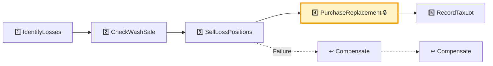
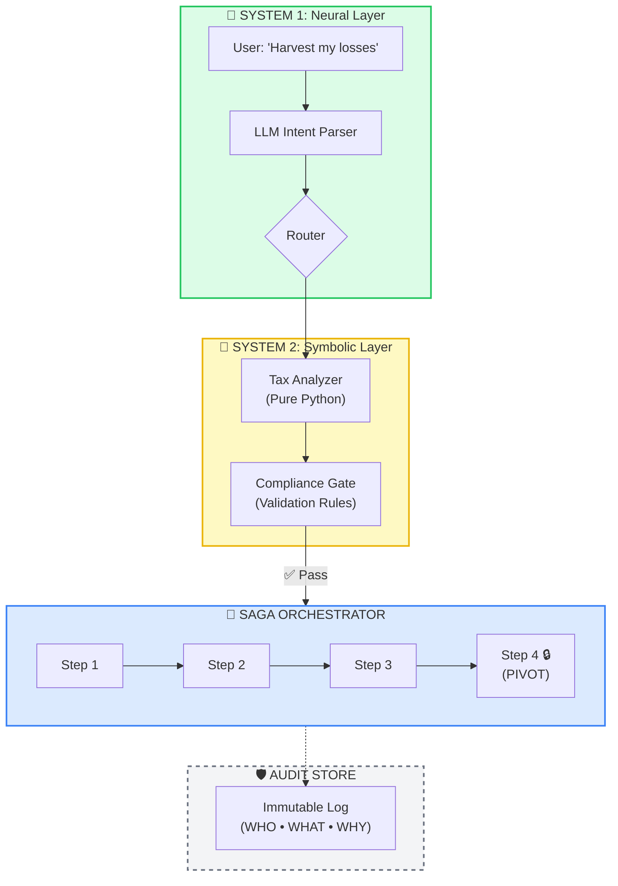

<div align="center">

# 🤖 Cyborg Advisor

### **The Neurosymbolic Financial Advisor**

*A production-ready reference implementation of the "Deterministic AI Pivot" for Wealth Management*

[](https://python.org)
[](https://typescriptlang.org)
[](https://react.dev)
[](https://fastapi.tiangolo.com)
[](https://langchain-ai.github.io/langgraph/)
[](LICENSE.md)

---

**🧠 LLMs for Language** · **🔢 Python for Math** · **🔄 Sagas for Transactions** · **🛡️ Logs for Audits** · **✋ Humans for Judgment**

[**📖 Read the Series**](#-the-wealth-ai-series) · [**🚀 Quick Start**](#-quick-start) · [**📐 Architecture**](#-architecture) · [**🔒 Security**](SECURITY.md)

</div>

---

## 💡 What is this?

The **Cyborg Advisor** is a **reference architecture** for building AI-powered financial applications that are:

| Challenge | Our Solution |
|-----------|--------------|
| ❌ LLMs hallucinate numbers | ✅ **The Math Ban:** LLMs *never* calculate. They route to deterministic Python. |
| ❌ Transactions can fail mid-way | ✅ **The Saga Pattern:** Every action is reversible until the "Pivot Point." |
| ❌ Regulators demand explainability | ✅ **Know Your Agent (KYA):** Every agent has a passport (DID) and an audit trail. |
| ❌ Personalization doesn't scale | ✅ **Direct Indexing:** Build 1,000 unique portfolios with the same code. |

This is not a chatbot. It's the **operating system** for the next generation of compliant, trustworthy wealth management AI.

---

## 📖 The Wealth AI Series

This project is the technical companion to a 5-part Substack series documenting the "build in public" journey.

| Part | Article | What You'll Learn |
|:----:|---------|-------------------|
| 1 | [**The Trust Wall**](substack_article_part1.md) | Why the GenAI Bubble burst in finance. The case for deterministic AI. |
| 2 | [**The Cyborg Blueprint**](substack_article_part2.md) | The Math Ban. The Saga Pattern. Compliance-by-Design. |
| 3 | [**Tax Alpha**](substack_article_part3.md) | Wash sale detection across 30+ fund families. The 5-step TLH Saga. |
| 4 | [**The Silicon Workforce**](substack_article_part4.md) | KYA Framework: Agent Identity (DID), RBAC, and Immutable Audit Logs. |
| 5 | [**Death of the Model Portfolio**](substack_article_part5.md) | Direct Indexing: Factor Tilts, ESG Exclusions, and "Segment of One." |

---

## ✨ Key Features

### 🛡️ Auditability System (Know Your Agent)

> *"You can't audit a vibe. If you're giving a robot a checkbook, give it a passport first."*

Every AI agent in the system is a traceable, accountable entity.

*   **Agent Identity (DID):** A cryptographic passport (`agent:tlh_optimizer:v1.2:a8f3`) for every agent version.
*   **Role-Based Access Control (RBAC):** A `Research_Agent` (READ_ONLY) cannot execute trades. A `Trading_Agent` (TRADE_MEDIUM) is capped at $100k.
*   **Immutable Audit Log:** An append-only record capturing:
    *   **WHO:** The agent's DID.
    *   **WHAT:** The action taken (`BUY 50 AAPL`).
    *   **WHY:** The reasoning trace (`Portfolio drift > 5%. AAPL satisfies quality factor.`).
*   **Validation Gates:** Deterministic, pre-execution checks (`Cash > 2%`, `No Wash Sale`) that block actions *before* they happen.

```python
# src/audit.py - The Digital Passport
@dataclass
class AgentIdentity:
    agent_id: str      # "agent:rebalance_bot:v1.2:c4a2"
    authority: AgentAuthority  # READ_ONLY, TRADE_SMALL, TRADE_MEDIUM, ADMIN
    version: str
    created_at: datetime
```

---

### 📊 Direct Indexing Engine

> *"The mutual fund was the greatest invention of the 20th century. Direct Indexing is the 21st."*

Build hyper-personalized "Segment of One" portfolios at scale.

*   **Factor Tilts:** Mathematically re-weight the S&P 500 for Value, Growth, Dividend, Momentum, or Quality.
*   **ESG Exclusions:** Deterministically filter out Tobacco, Defense, Fossil Fuels, or Gambling with a single click.
*   **Tax-Lot Optimization:** Seamlessly integrates with the TLH engine to minimize tax impact during rebalancing.
*   **Tracking Error Calculation:** Shows the impact of customizations vs. the benchmark.

```python
# src/direct_indexing.py - The "Segment of One"
index = CustomIndex.create(
    name="My ESG Growth Index",
    benchmark=Benchmark.SP500,
    factor_tilts=[
        FactorTilt(factor=FactorType.GROWTH, weight=0.3),
        FactorTilt(factor=FactorType.QUALITY, weight=0.2),
    ],
    exclusions=[
        ExclusionRule(type=ExclusionType.ESG_CATEGORY, values=["tobacco", "fossil_fuels"]),
    ],
)
```

| Client Profile | Customization | Result |
|----------------|---------------|--------|
| Tech Employee | S&P 500 minus Tech (hedge job risk), +20% Value | Reduced concentration risk |
| Climate Activist | Exclude Fossil Fuels, +30% Quality | Values-aligned portfolio |
| Retiree | +50% Dividend Tilt, Max TLH | Optimized income stream |

---

### 📉 Tax-Loss Harvesting Saga

> *"The best AI systems aren't smart. They're relentless."*

A 5-step transactional workflow with automatic rollback on failure.

*   **Expanded Wash Sale Detection:** Scans 30+ fund families. Knows that `VTI` and `ITOT` are "substantially identical" even though they're different tickers.
*   **Replacement Suggestions:** Automatically suggests safe alternatives (e.g., `VTI` → `SCHD`).
*   **Pivot Transaction:** The "Point of No Return." Before Step 4, failures trigger automatic rollback. After Step 4, the system proceeds forward-only.



| Fund Family | Substantially Identical Tickers |
|-------------|--------------------------------|
| Total US Stock | VTI, ITOT, SCHB, SPTM |
| S&P 500 | SPY, VOO, IVV, SPLG |
| Total Bond Market | BND, AGG, SCHZ |
| Gold | GLD, IAU, SGOL |

---

## 📐 Architecture

The **Neurosymbolic Stack** separates "thinking" from "doing."



### The Golden Rule

> ***"AI doesn't do math; it calls a calculator."***

| Layer | Role | Technology |
|-------|------|------------|
| **Neural (System 1)** | Parse intent, route requests, synthesize responses. | LLM (Gemini, GPT, Claude) |
| **Symbolic (System 2)** | All calculations, tax rules, compliance logic. | Pure Python + Pandas |
| **Saga Orchestrator** | Manage multi-step transactions with rollback. | Custom Pattern |
| **Audit Store** | Immutable, append-only log for every action. | Custom + DID |

---

## 🚀 Quick Start

### Prerequisites
*   Python 3.10+
*   Node.js 18+
*   A Gemini/OpenAI API Key (optional, for LLM features)

### 1. Clone the Repository
```bash
git clone https://github.com/hiteshdundi01/CyborgAdvisor.git
cd CyborgAdvisor
```

### 2. Start the Backend (FastAPI)
```bash
cd backend
python -m venv venv
# Windows: venv\Scripts\activate
# macOS/Linux: source venv/bin/activate
pip install -r requirements.txt

python -m uvicorn main:app --reload
# API Docs: http://localhost:8000/docs
```

### 3. Start the Frontend (React + Vite)
```bash
cd frontend
npm install
npm run dev
# Dashboard: http://localhost:5173
```

---

## 🖥️ The Dashboard

A premium, dark-themed SaaS dashboard with glassmorphism design.

| Page | Features |
|------|----------|
| 📊 **Dashboard** | Portfolio overview, allocation charts, activity feed. |
| 💼 **Portfolio Manager** | CRUD for holdings with inline editing. |
| ⚖️ **Rebalance Center** | Target allocation sliders, proposed trades, saga execution. |
| 📉 **Tax Loss Harvesting** | Loss scanner, wash sale indicators, 1-click harvest. |
| 📈 **Direct Indexing** | Factor tilt sliders, ESG exclusion toggles, portfolio builder. |
| 🛡️ **Audit Monitor** | Event timeline, reasoning traces, agent registry. |
| 🔄 **Saga Monitor** | Execution history, step-by-step visualization. |

---

## 🔌 API Reference

All endpoints are available at `http://localhost:8000/docs` (Swagger UI).

### Core Endpoints

| Category | Endpoint | Description |
|----------|----------|-------------|
| **Audit** | `GET /api/v1/audit/transactions` | Query audited transactions. |
| **Audit** | `GET /api/v1/audit/agents` | List registered KYA agents. |
| **TLH** | `GET /api/v1/tax-loss-harvest/opportunities` | Scan for harvestable losses. |
| **TLH** | `POST /api/v1/tax-loss-harvest/execute` | Run the 5-step TLH Saga. |
| **Direct Indexing** | `POST /api/v1/direct-indexing/indices` | Create a custom index. |
| **Direct Indexing** | `POST /api/v1/direct-indexing/construct` | Build a portfolio from an index. |
| **Saga** | `GET /api/v1/saga/{id}/stream` | Real-time saga status (SSE). |

---

## 📁 Project Structure

```
CyborgAdvisor/
├── README.md
├── SECURITY.md               # Vulnerability reporting policy
├── CONTRIBUTING.md           # Contribution guidelines
├── LICENSE.md                # MIT License
│
├── backend/                  # 🐍 FastAPI Backend
│   └── main.py               # 14+ API endpoints
│
├── frontend/                 # ⚛️ React + Vite + TypeScript
│   └── src/pages/            # Dashboard, TLH, DirectIndexing, Audit...
│
├── src/                      # 🧠 Core Logic (Neurosymbolic Engine)
│   ├── audit.py              # KYA Framework, DID, RBAC, AuditStore
│   ├── direct_indexing.py    # Factor Tilts, ESG, CustomIndex
│   └── sagas/
│       ├── core.py           # SagaOrchestrator, TransactionStep
│       ├── rebalance.py      # 4-step Rebalance Saga
│       ├── tax_loss_harvesting.py  # 5-step TLH Saga
│       └── direct_indexing.py      # 7-step DI Saga
│
├── tests/                    # ✅ Pytest Suite
│   ├── test_saga_core.py
│   └── test_tax_loss_harvesting.py
│
└── docs/                     # 📚 Documentation & Research
    └── Deterministic AI Pivot.txt
```

---

## 🧪 Testing

```bash
# Run the full test suite
pytest tests/ -v

# Run a specific test file
pytest tests/test_tax_loss_harvesting.py -v
```

---

## 🗺️ Roadmap

- [x] **Phase 1:** Neurosymbolic Architecture (The Math Ban)
- [x] **Phase 2:** Saga Pattern (Transactional Integrity)
- [x] **Phase 3:** Tax-Loss Harvesting (Wash Sale Detection)
- [x] **Phase 4:** Auditability System (KYA, DID, RBAC)
- [x] **Phase 5:** Direct Indexing at Scale
- [ ] **Phase 6:** Household-Level Optimization
- [ ] **Phase 7:** Multi-Custodian Support

---

## 🤝 Contributing

We welcome contributions! Please see [**CONTRIBUTING.md**](CONTRIBUTING.md).

1.  Fork the Project
2.  Create your Feature Branch (`git checkout -b feature/AmazingFeature`)
3.  Commit your Changes (`git commit -m 'Add some AmazingFeature'`)
4.  Push to the Branch (`git push origin feature/AmazingFeature`)
5.  Open a Pull Request

---

## 🔒 Security

Please read our [**Security Policy**](SECURITY.md) for reporting vulnerabilities.

---

<div align="center">

---

### The Art of the Possible

*The first-generation chatbots hit the Trust Wall because they tried to **substitute** for human judgment.*  
*The Cyborg Advisor succeeds because it **amplifies** human judgment.*

**The chatbot is dead. Long live the Cyborg.**

---

**Built with** 🧠 LangGraph · ⚛️ React · 🐍 FastAPI · 🤖 Google Gemini · 📊 Recharts

[](LICENSE.md)

</div>
