# 🤖 Cyborg Advisor

## Neurosymbolic Portfolio Rebalancer

<div align="center">


**A cognitive architecture that separates fast intuition from slow deliberation**

*LLMs handle intent. Python handles math. Humans stay in control.*

</div>

---

## 🧠 The "System 1 vs System 2" Architecture

Inspired by Daniel Kahneman's dual-process theory, this system separates:

| System 1 (Fast/Intuitive) | System 2 (Slow/Deliberate) |
|---------------------------|----------------------------|
| 🤖 LLM-powered | 🐍 Pure Python |
| Intent classification | Financial calculations |
| Natural language | Pandas/NumPy |
| Response generation | Compliance rules |
| *"What does the user want?"* | *"What are the exact numbers?"* |

> **Why?** LLMs are excellent at understanding language but unreliable at math. By enforcing a strict separation, we get the best of both worlds: intuitive interfaces with deterministic accuracy.

---

## 📐 Architecture

```mermaid
flowchart TB
    subgraph Input
        A[👤 User Message]
    end
    
    subgraph System1["🧠 System 1 - LLM (Fast Thinking)"]
        B[Intent Parser]
        B -->|"intent: query"| C[Response Generator]
        B -->|"intent: respond"| C
    end
    
    subgraph System2["🔢 System 2 - Python (Slow Thinking)"]
        D[Financial Calculator]
        E[Compliance Check]
        D --> E
    end
    
    subgraph HITL["✋ Human-in-the-Loop"]
        F[Human Review]
        G[Execute Trades]
        H[Cancel Trades]
    end
    
    A --> B
    B -->|"intent: rebalance"| D
    E -->|"✅ pass"| F
    E -->|"❌ fail"| C
    F -->|"approved"| G
    F -->|"rejected"| H
    
    C --> I[📤 Response]
    G --> I
    H --> I
    
    style System1 fill:#e8f5e9,stroke:#4caf50
    style System2 fill:#fff3e0,stroke:#ff9800
    style HITL fill:#e3f2fd,stroke:#2196f3
```



---

## 🚀 Quick Start

### 1. Clone and Setup Virtual Environment

```bash
# Navigate to project directory
cd "c:\Users\hites\Public Projects\CyborgAdvisor"

# Create virtual environment
python -m venv venv

# Activate (Windows)
venv\Scripts\activate

# Activate (macOS/Linux)
source venv/bin/activate
```

### 2. Install Dependencies

```bash
pip install -r requirements.txt
```

### 3. Configure API Key

```bash
# Copy example config
copy .env.example .env

# Edit .env and add your Google API key
# GOOGLE_API_KEY=your_key_here
```

### 4. Run the Demo

```bash
# Full demo with LLM
python main.py

# Simplified demo (calculations only, no LLM)
python main.py --simple
```

---

## 🔧 Configuration

### Model Selection

The Cyborg Advisor supports **any Google Gemini model**. Configure in `.env`:

```env
# Choose your model
MODEL_NAME=gemini-2.0-flash      # Fast, efficient
MODEL_NAME=gemini-2.5-pro        # Most capable
MODEL_NAME=gemini-2.5-flash      # Balanced

# Model parameters
MODEL_TEMPERATURE=0.1            # Low for consistency
MODEL_MAX_TOKENS=4096
```

### Runtime Model Switching

```python
from src.config import get_llm

# Use default model
llm = get_llm()

# Override at runtime
llm = get_llm("gemini-2.5-pro")
```

---

## 📊 State Machine

The LangGraph state flows through these nodes:

```mermaid
stateDiagram-v2
    [*] --> IntentParser: User message
    
    IntentParser --> FinancialCalculator: rebalance
    IntentParser --> ResponseGenerator: query/respond
    
    FinancialCalculator --> ComplianceCheck: trades calculated
    
    ComplianceCheck --> HumanReview: ✅ passed
    ComplianceCheck --> ResponseGenerator: ❌ failed
    
    HumanReview --> ExecuteTrades: approved
    HumanReview --> CancelTrades: rejected
    
    ExecuteTrades --> [*]
    CancelTrades --> [*]
    ResponseGenerator --> [*]
```



---

## 🛡️ Compliance Rules

All trades must pass deterministic validation:

| Rule | Description | Threshold |
|------|-------------|-----------|
| **Cash Position** | Resulting cash must stay positive | ≥ 2% of portfolio |
| **Trade Size** | No single trade too large | ≤ 10% of portfolio |

Rules are enforced with pure Python—**no LLM involved**.

---

## 💻 API Reference

### AgentState

```python
class AgentState(TypedDict):
    messages: list              # Chat history
    user_input: str             # Current message
    intent: str                 # rebalance/query/respond
    portfolio_data: dict        # Current holdings
    target_allocation: dict     # Target weights
    proposed_trades: list       # Calculated trades
    compliance_status: bool     # Passed all rules?
    compliance_errors: list     # Any violations
    human_approval: bool        # User approved?
    response: str               # Output message
```

### Core Functions

```python
# Calculate rebalance trades (NO LLM)
from src.nodes.financial_calculator import calculate_rebalance
trades = calculate_rebalance(portfolio_data, target_allocation)

# Run compliance checks (NO LLM)
from src.nodes.compliance_check import run_compliance_checks
passed, errors = run_compliance_checks(trades, portfolio_data)

# Get configured LLM
from src.config import get_llm
llm = get_llm("gemini-2.5-flash")
```

---

## 📁 Project Structure

```
CyborgAdvisor/
├── main.py                    # Demo entry point
├── requirements.txt           # Dependencies
├── .env.example              # Config template
├── src/
│   ├── __init__.py
│   ├── config.py             # Model configuration
│   ├── state.py              # AgentState definition
│   ├── graph.py              # LangGraph state machine
│   └── nodes/
│       ├── intent_parser.py      # System 1: LLM intent
│       ├── financial_calculator.py # System 2: Math
│       ├── compliance_check.py    # System 2: Rules
│       ├── response_generator.py  # System 1: LLM response
│       └── human_review.py        # HITL checkpoint
├── tests/
│   ├── test_financial_calculator.py
│   ├── test_compliance_check.py
│   └── test_graph_flow.py
└── docs/
    └── architecture.md
```

---

## 🧪 Testing

```bash
# Run all tests
pytest tests/ -v

# Test deterministic components only
pytest tests/test_financial_calculator.py -v
pytest tests/test_compliance_check.py -v
```

---

## 🎯 Design Philosophy

### Why Separate LLM from Calculations?

1. **Accuracy**: LLMs hallucinate numbers. Python doesn't.
2. **Auditability**: Deterministic code can be verified.
3. **Reproducibility**: Same inputs = same outputs.
4. **Compliance**: Regulatory requirements demand explainable math.

### Why Human-in-the-Loop?

1. **Safety**: Large trades need human verification.
2. **Trust**: Users should approve their own trades.
3. **Compliance**: Many regulations require human oversight.

---

## 📝 License

MIT License - See [LICENSE](LICENSE) for details.

---

<div align="center">

**Built with 🧠 LangGraph • 🐍 Python • 🤖 Google Gemini**

</div>
