# 🤖 Cyborg Advisor

<div align="center">

### **The Neurosymbolic Rebalancer**

*A reference implementation of the "Deterministic AI Pivot" for Wealth Management*

[](https://python.org)
[](https://langchain-ai.github.io/langgraph/)
[](https://streamlit.io)

---

**LLMs handle intent. Python handles math. Humans stay in control.**

*Demonstrating the art of the possible for enterprise AI in finance.*

</div>

---

## 📖 Why This Exists: The Trust Wall

> *"The year 2026 stands as a definitive inflection point... The 'GenAI Bubble' of 2024-2025 has cooled, giving way to a more rigorous, disciplined operational reality."*
> — **The Deterministic AI Pivot**

### The Problem with "GenAI Chatbots" in Finance

The initial wave of generative AI in wealth management focused on **conversational interfaces**—chatbots that could answer questions using LLMs. But these probabilistic systems hit what industry analysts call the **"Trust Wall"**:

| ❌ The Problem | Why It Fails in Finance |
|----------------|------------------------|
| **Hallucinations** | LLMs fabricate numbers, tax rules, and regulations with confident language |
| **Non-Determinism** | The same question yields different answers—unacceptable for audits |
| **Black Box Opacity** | No explainable "chain of thought" for regulators (SEC, FCA mandates) |
| **Zero Tolerance** | A single miscalculation in tax-loss harvesting = millions in liability |

The painful truth: **"99% accurate" is insufficient for fiduciary execution.**

### The Solution: Neurosymbolic AI

The Cyborg Advisor demonstrates the **2026 architectural pivot**—a fusion of:

| System 1 (LLM) | System 2 (Python) |
|----------------|-------------------|
| 🧠 Fast, intuitive | 🔢 Slow, deliberate |
| Intent parsing | Financial calculations |
| Natural language | Pandas/NumPy |
| "What does the user want?" | "What are the exact numbers?" |

> **The Core Principle:** LLMs excel at understanding language but are *unreliable at math*. By enforcing strict separation, we achieve intuitive interfaces with **deterministic accuracy**.

---

## 🎯 What This Demonstrates

The Cyborg Advisor is a **reference implementation** showcasing how to build production-grade AI for regulated industries. It proves:

### 1. The "Math Ban" Architecture
```
✅ LLM parses: "Please rebalance to 60% stocks"
✅ Python calculates: Exact trades using Pandas/NumPy
❌ LLM never touches the numbers
```

### 2. Compliance-by-Design
Every AI action passes through **deterministic validation layers** before execution:
- Rule A: Cash position ≥ 2% (no negative cash)
- Rule B: No single trade > 10% of portfolio
- Transparent, auditable decision logs

### 3. Human-in-the-Loop Governance
The **"Human-on-the-Loop"** model mandated by EU AI Act:
- Low risk → Autonomous execution
- Medium risk → Post-hoc review
- High risk → **Pre-approval required** (trades pause for human sign-off)

### 4. "Know Your Agent" (KYA) Principles
- Every agent action is traceable
- Scope of authority is explicitly defined
- Complete audit trail for regulatory inquiries

---

## 📐 Architecture

### The Neurosymbolic Stack + Transactional Saga Pattern

```mermaid
flowchart TB
    subgraph Neural["🧠 SYSTEM 1: Neural Layer (LLM)"]
        A[User: 'Rebalance my portfolio'] --> B[Intent Parser]
        B --> |"intent: rebalance"| C{Route}
    end
    
    subgraph Symbolic["🔢 SYSTEM 2: Symbolic Layer (Python)"]
        D[Financial Calculator<br/>Pure Pandas - NO LLM]
        E[Compliance Engine<br/>Deterministic Rules]
        D --> E
    end
    
    subgraph Saga["🔄 SAGA ORCHESTRATOR"]
        S1[1. ValidateMarket]
        S2[2. PlaceSellOrders]
        S3[3. SettleCash]
        S4[4. PlaceBuyOrders 🔒]
        S1 --> S2 --> S3 --> S4
        S4 -.->|"Failure"| R3[Compensate S3]
        R3 -.-> R2[Compensate S2]
        R2 -.-> R1[Compensate S1]
    end
    
    subgraph Human["✋ HUMAN-IN-THE-LOOP"]
        F[Review Checkpoint]
        G[Saga Execution]
        H[Cancel]
    end
    
    C --> D
    E -->|"✅ Pass"| F
    E -->|"❌ Fail"| I[Error Response]
    F -->|"Approve"| G
    G --> Saga
    F -->|"Reject"| H
    
    style Neural fill:#e8f5e9,stroke:#4caf50,stroke-width:2px
    style Symbolic fill:#fff3e0,stroke:#ff9800,stroke-width:2px
    style Human fill:#e3f2fd,stroke:#2196f3,stroke-width:2px
    style Saga fill:#fce4ec,stroke:#e91e63,stroke-width:2px
```



### The Saga Pattern: Transactional Integrity

| Component | Description |
|-----------|-------------|
| **Orchestrator** | Python state machine (not the LLM) that manages workflow |
| **Local Transactions** | Atomic steps: ValidateMarket → PlaceSellOrders → SettleCash → PlaceBuyOrders |
| **Compensating Transactions** | Automatic "undo" for each step if a later step fails |
| **Pivot Transaction** | Point-of-no-return (🔒) — PlaceBuyOrders cannot be reversed |
| **Idempotency** | Duplicate requests are detected and skipped |

> **Critical Question:** *"If the AI Agent crashes halfway through a portfolio rebalance, does the system automatically revert to the original state, or does it leave the client in cash?"*
> 
> **Answer:** The Saga Pattern ensures automatic rollback. If Step 4 fails, Steps 3, 2, and 1 are compensated in reverse order.

### The "Fact-First" Principle

Unlike naive RAG that retrieves text, this architecture:

1. **LLM (Dimension Table)** — Interprets and contextualizes
2. **Python (Fact Table)** — Stores discrete, verifiable truths
3. **Saga Layer** — Ensures transactional integrity with rollback
4. **Validation Layer** — Checks outputs against deterministic constraints

> *"AI doesn't do math; it calls the calculator. And if it fails, it hits Ctrl+Z."*

---

## 🚀 Quick Start

### 1. Setup Environment

```bash
cd "c:\Users\folder name"

# Create virtual environment
python -m venv venv
venv\Scripts\activate  # Windows
# source venv/bin/activate  # macOS/Linux

# Install dependencies
pip install -r requirements.txt
```

### 2. Configure API Key

```bash
copy .env.example
# Edit .env and add: GOOGLE_API_KEY=your_key_here
```

### 3. Run the Application

```bash
# 🌐 Launch Streamlit Web UI (recommended)
streamlit run app.py

# CLI demo with full LLM workflow
python main.py

# CLI demo (pure calculations, no LLM)
python main.py --simple
```

---

## 🖥️ The Streamlit UI

<div align="center">

| Feature | Description |
|---------|-------------|
| 📊 **Portfolio Dashboard** | Real-time allocation visualization |
| ✏️ **Custom Portfolio Editor** | Add, edit, delete holdings interactively |
| 🎯 **Target Allocation Sliders** | Set your desired asset mix |
| � **System 2 Calculations** | Watch deterministic math, not LLM guessing |
| 🛡️ **Compliance Status** | See rule validation in real-time |
| ✋ **Approval Workflow** | Approve or reject trades before execution |

</div>

---

## 🔧 Model Configuration

The Cyborg Advisor supports **any Google Gemini model**:

```env
# .env configuration
MODEL_NAME=gemini-2.0-flash      # Fast, efficient (default)
MODEL_NAME=gemini-2.5-pro        # Most capable
MODEL_NAME=gemini-2.5-flash      # Balanced
```

```python
# Runtime switching
from src.config import get_llm
llm = get_llm("gemini-2.5-pro")  # Override anytime
```

---

## �️ The Validation Stack

### Defense-in-Depth Against Hallucination

| Tier | Purpose | Implementation |
|------|---------|----------------|
| **1. Input Guardrails** | Prevent prompt injection | Intent Parser validates scope |
| **2. Tool Grounding** | "Math Ban" enforcement | LLM calls Python, never calculates |
| **3. Output Validation** | Logic gates before action | Compliance rules block invalid trades |
| **4. Human-in-the-Loop** | Risk-based escalation | Checkpoint before execution |

---

## 📁 Project Structure

```
CyborgAdvisor/
├── app.py                     # 🌐 Streamlit Web UI
├── main.py                    # CLI demo entry point
├── requirements.txt
├── .env.example
├── src/
│   ├── config.py              # Flexible Google model config
│   ├── state.py               # AgentState TypedDict
│   ├── graph.py               # LangGraph state machine
│   ├── nodes/
│   │   ├── intent_parser.py       # System 1: LLM intent
│   │   ├── financial_calculator.py # System 2: Pandas math
│   │   ├── compliance_check.py     # System 2: Rule validation
│   │   ├── response_generator.py   # System 1: LLM response
│   │   └── human_review.py         # HITL + Saga execution
│   └── sagas/                 # 🔄 Transactional Saga Engine
│       ├── core.py                # SagaOrchestrator, TransactionStep
│       └── rebalance.py           # 4-step Rebalance Saga
├── tests/                     # Pytest test suite
└── docs/
    ├── architecture.md        # Detailed technical diagrams
    └── Deterministic AI Pivot.txt  # Industry context
```

---

## 🎓 The Bigger Picture: Operational Alpha

This project demonstrates how firms achieve **"Operational Alpha"**—the competitive advantage from superior operational efficiency:

| Metric | Impact |
|--------|--------|
| **Cost-to-Serve** | ↓ 20-30% via automation |
| **Advisor Capacity** | ↑ 3-5x relationships per advisor |
| **AUM Retention** | ↑ 15% via predictive engagement |
| **Turnaround Time** | ↓ 30-50% faster onboarding |

> *"The competitive moat in wealth management is no longer the algorithm—which has become commoditized—but the **architecture of trust** that surrounds it."*

---

## 🧪 Testing

```bash
# Run all tests
pytest tests/ -v

# Test deterministic components (no LLM required)
pytest tests/test_financial_calculator.py -v
pytest tests/test_compliance_check.py -v
```

---

## 📚 Further Reading

- [docs/architecture.md](docs/architecture.md) — Detailed technical diagrams and research

---

<div align="center">

### **The Art of the Possible**

*This reference implementation proves that AI can be both intelligent AND trustworthy.*

*LLMs for language. Python for math. Humans for judgment.*

---

**Built with** 🧠 LangGraph • 🐍 Python • 🤖 Google Gemini • 📊 Streamlit

</div>
