# Cyborg Advisor Architecture

## Detailed Technical Documentation

This document provides in-depth architectural diagrams and explanations for the Neurosymbolic Rebalancer.

---

## 1. High-Level System Architecture

```mermaid
graph TB
    subgraph External["🌐 External"]
        USER[👤 User]
        GEMINI[🤖 Google Gemini API]
    end
    
    subgraph CyborgAdvisor["🧠 Cyborg Advisor"]
        subgraph LangGraph["LangGraph State Machine"]
            ENTRY[Entry Point]
            IP[Intent Parser]
            FC[Financial Calculator]
            CC[Compliance Check]
            HR[Human Review]
            ET[Execute Trades]
            CT[Cancel Trades]
            RG[Response Generator]
        end
        
        subgraph Core["Core Modules"]
            STATE[AgentState]
            CONFIG[Model Config]
        end
    end
    
    USER -->|message| ENTRY
    IP <-->|LLM calls| GEMINI
    RG <-->|LLM calls| GEMINI
    ENTRY --> IP
    IP --> FC
    FC --> CC
    CC --> HR
    HR --> ET
    HR --> CT
    
    STATE -.->|flows through| LangGraph
    CONFIG -.->|configures| IP
    CONFIG -.->|configures| RG
    
    style CyborgAdvisor fill:#f5f5f5,stroke:#333
    style LangGraph fill:#e8f5e9,stroke:#4caf50
    style Core fill:#fff3e0,stroke:#ff9800
```



---

## 2. Data Flow Diagram


---

## 3. State Transformations

Each node reads and writes specific state fields:


---

## 4. Component Responsibilities

### Node Responsibility Matrix

| Node | Input | Processing | Output | Uses LLM? |
|------|-------|------------|--------|-----------|
| **Intent Parser** | user_input | Classify intent, extract parameters | intent, target_allocation | ✅ Yes |
| **Financial Calculator** | portfolio_data, target_allocation | Calculate buy/sell orders | proposed_trades | ❌ No |
| **Compliance Check** | proposed_trades, portfolio_data | Apply rules | compliance_status, errors | ❌ No |
| **Human Review** | proposed_trades | Present for approval | human_approval | ❌ No |
| **Execute Trades** | proposed_trades | Mock execution | response | ❌ No |
| **Response Generator** | state context | Generate message | response | ✅ Yes |

---

## 5. Sequence Diagrams

### Rebalance Flow (Happy Path)


### Compliance Failure Flow


---

## 6. Compliance Rules Specification

### Rule A: Cash Position Rule

```
┌─────────────────────────────────────────────────────┐
│ RULE: Resulting cash position must remain positive  │
├─────────────────────────────────────────────────────┤
│ Threshold:  Minimum 2% of total portfolio value     │
│                                                     │
│ Calculation:                                        │
│   resulting_cash = current_cash + net_trade_effect  │
│   min_required = total_portfolio * 0.02             │
│                                                     │
│ Validation:                                         │
│   IF resulting_cash < 0:                            │
│       FAIL "Negative cash position"                 │
│   IF resulting_cash < min_required:                 │
│       FAIL "Below 2% minimum"                       │
│   ELSE:                                             │
│       PASS                                          │
└─────────────────────────────────────────────────────┘
```

### Rule B: Trade Size Rule

```
┌─────────────────────────────────────────────────────┐
│ RULE: No single trade > 10% of portfolio value      │
├─────────────────────────────────────────────────────┤
│ Threshold:  Maximum 10% per trade                   │
│                                                     │
│ Calculation:                                        │
│   max_trade = total_portfolio * 0.10                │
│                                                     │
│ Validation:                                         │
│   FOR EACH trade IN proposed_trades:                │
│       IF trade.amount > max_trade:                  │
│           FAIL "Trade exceeds limit"                │
│   PASS                                              │
└─────────────────────────────────────────────────────┘
```

---

## 7. Model Configuration Architecture


### Switching Models at Runtime

```python
# Default (from .env)
from src.config import get_llm
llm = get_llm()  # Uses MODEL_NAME from environment

# Override for specific use case
llm = get_llm("gemini-2.5-pro")  # Use most capable model

# Create new config entirely
from src.config import ModelConfig
config = ModelConfig(
    model_name="gemini-2.5-flash",
    temperature=0.3,
    max_tokens=8192
)
llm = config.get_llm()
```

---

## 8. Error Handling Flow


---

## 9. Future Enhancements

### Planned Extensions

1. **Broker Integration**: Connect to real trading APIs
2. **Multi-Asset Rebalancing**: Support for individual securities
3. **Tax-Loss Harvesting**: Add tax optimization node
4. **Risk Assessment**: Pre-trade risk analysis node
5. **Audit Logging**: Complete decision trail

### Architecture for Extensions


